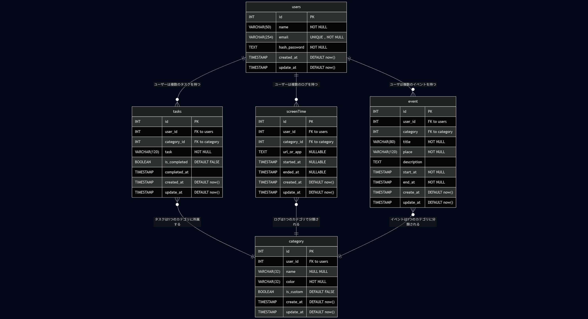

# time-aware-todo


## 🔍目次

- [概要](#概要)
- [使用技術](#使用技術)
- [システム構成](#システム構成)
- [セットアップ手順](#セットアップ手順)
- [ER図](#ER図)
- [テスト方法](#テスト方法)
- [ディレクトリ構成](#ディレクトリ構成)
- [今後の課題](#今後の課題)
- [ライセンス](#ライセンス)


## 📚概要
このアプリは、PCとスマートフォンでタスク・スクリーンタイムを一元管理し、時間の使い方を「見える化」するアプリです。<br>
就活用のポートフォリオとして、React / FastAPI / PostgreSQLを用いて開発します。

私自身、就活中に企業のマイページやイベント日程がさまざまなサービスに分散していたため、情報の整理や予定の把握に苦労し、「大事なイベントを見落としそうになった」経験があります。また、同時期に自分の生活習慣を振り返った際、思った以上にYouTubeなどの動画視聴に時間を使っていたことに気づき、「時間の使い方そのものを見える化したい」と強く感じました。

こうした気づきをもとに、「タスクやイベントを時間軸で管理・可視化し、通知や記録によって行動改善を支援する」アプリの開発に取り組んでいます。


## 🔧使用技術・ツール

### 使用技術
| 区分           | 使用技術          |
|---------------|-------------------|
| フロントエンド  | React            |
| バックエンド   | FastAPI / Python  |
| データベース   | PostgreSQL        |

### 使用ツール
- ChatGPT（アイデアから設計までの壁打ちに活用）
- Figma（画面設計）
- Git / GitHub（バージョン管理）
- Docker / Docker Compose（仮想環境構築）

## システム構成
**後日追加予定**


## 🏢セットアップ手順
このアプリは、Dockerを使用してローカル環境で簡単に立ち上げることができます。以下の手順で環境構築してください。

※DockerとDocker Composeのインストールが事前に必要です。<br>
※DB接続に.envファイルを使用しているため、事前に.envファイルを作成してください

### 0. .envファイルを作成
ルートディレクトリに.envファイルを作成し、以下の内容を記述してください。（値は必要に応じて変更してください）

```env
# PostgreSQLの環境変数

POSTGRES_USER=YourUser
POSTGRES_PASSWORD=YourPassword
POSTGRES_DB=YourDB
```

### 1. このリポジトリをクローン
```bash
git clone https://github.com/rrr-bit00/time-aware-todo.git
cd time-aware-todo
```

### 2. Docker-composeでコンテナを起動
```bash
docker compose up --build -d
```
- フロントエンド： http://localhost:3001
- バックエンド： http://localhost:8001

### 3. コンテナの停止
```bash
docker compose down
```

## 🗺️ER図



## テスト方法
`pytest`等によるテストを予定


## 📁ディレクトリ構成

### 🌳 Rootディレクトリ
```plaintext
career-event-hub/
├── frontend/
├── backend/
├── docker/             # 将来的に追加
├── docker-compose.yml
├── .env                # 実際には.gitignore対象
├── .gitignore
├── README.md
└── LICENSE
```
### 🎨 Frontend
```plaintext
frontend/
├── public/     # 静的ファイル（favicon, manifest など）
├── src/        # アプリ本体（App, indexなど）
│   ├── App.js
│   ├── index.js
│   └── ...
├── package.json
├── Dockerfile
└── .gitignore
```

### 🧠Backend
```plaintext
backend/
├── main.py            # FastAPIエントリーポイント
├── requirements.txt   # 依存パッケージ
├── Dockerfile
├── .gitignore
├── routers/           # 各エンドポイント（今後追加予定）
│   └── user.py          # 例：ユーザー関連ルート
├── schemas/           # Pydanticモデル（今後追加予定）
│   └── user.py
├── models/            # DBモデル（SQLAlchemy）（今後追加予定）
│   └── user.py
├── db/                # DBの接続やセッションなどを管理（今後追加予定）
│   └── session.py
├── utils/            # パスワードのハッシュ化やトークン作成などの関数を管理（今後追加予定）
│   └── security.py

```


## ⛓️開発ルール

### ブランチ命名規則

以下のプレフィックスを用いて、作業内容ごとにブランチを分類しています。

| 種類        | 説明                          | 例                                     |
|-------------|-------------------------------|---------------------------------------|
| `feat/`     | 新機能の追加                   | `feat/event-registration`             |
| `fix/`      | バグ修正                       | `fix/invalid-login`                   |
| `docs/`     | ドキュメントの変更・追加        | `docs/update-readme`                  |
| `chore/`    | ツール、設定、非機能の変更      | `chore/add-backend-gitignore`         |
| `ref/`      | コード整理                     | `ref/clean-event-model`               |
| `test/`     | テストコードの追加・修正        | `test/add-api-tests`                  |


## 👓今後の課題
完成後記述予定


## ⚖️ライセンス
- [MITライセンス](LICENSE)
